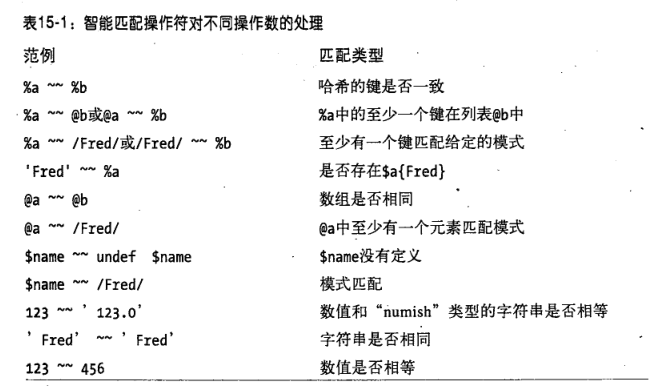

## babel-macro-smart-match 模拟perl的智能匹配


```js
import m from "./smart-match.macro";

let b = { name: 'ajanuw' };
console.log(m`'age' ~~ b`); // false
```

## test
```shell
λ npm run build && node dist/index.js
```